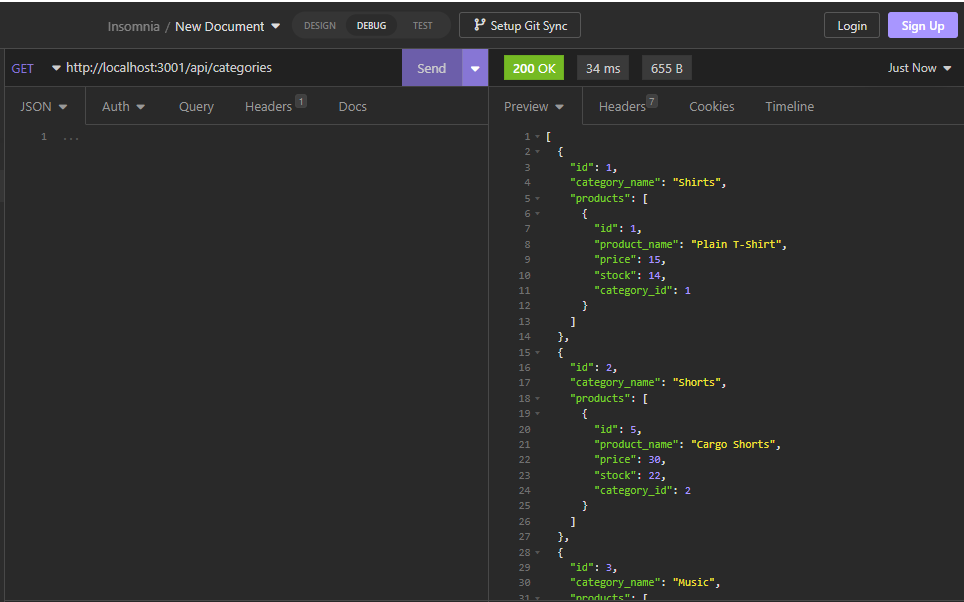
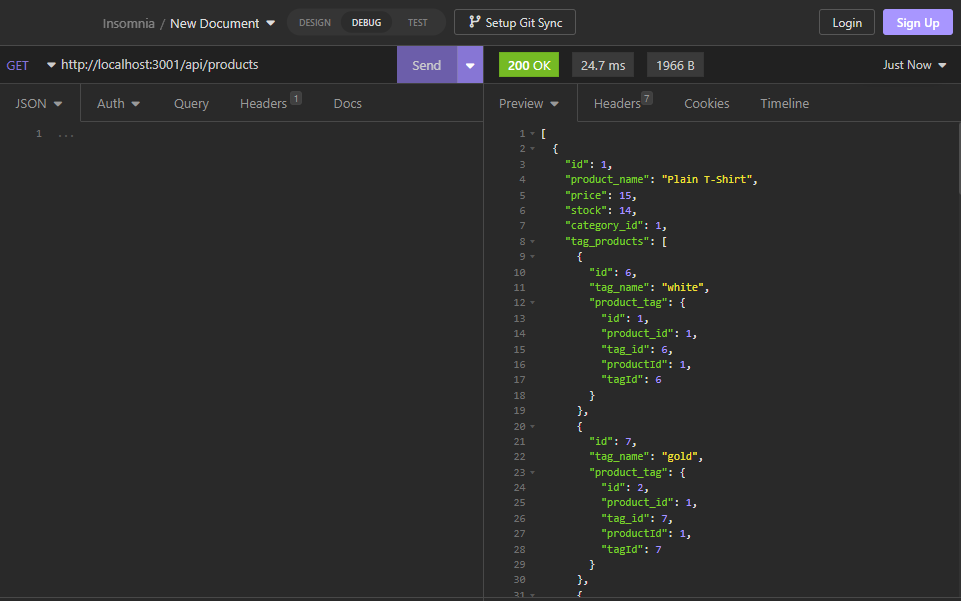
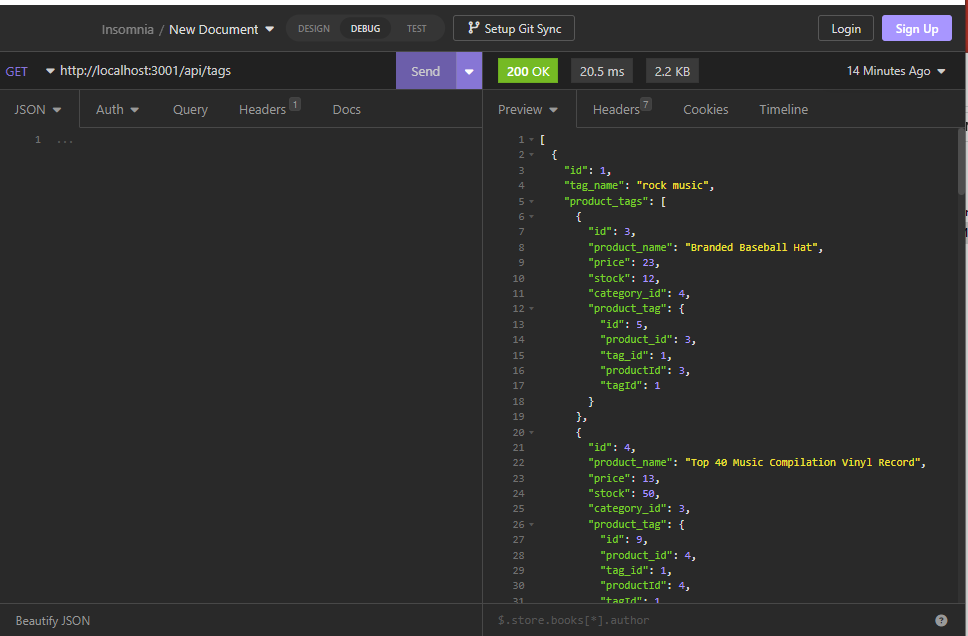

# E-Commerce-Back-End

## Description

AS A recently hired manager at an internet retail company I WANT a back end for my e-commerce website that uses the latest technologies SO THAT my company can compete with other e-commerce companies.

This project came with starter code already which was nice - the project was to connect all the pieces so we can git, post, put and delete from the different databases.

I learned a lot during this project - I learned a bit more about insomnia, I also learned that using a variable and an alias can be a bad thing - its very difficult to find and it will break your code.

## Table of Contents

If your README is long, add a table of contents to make it easy for users to find what they need.

- [Installation](#installation)
- [Usage](#usage)
- [Credits](#credits)
- [License](#license)

## Installation

If you are launching the program from command line you will have to begin by doing an 'npm install' to install the dependancies

Once this is complete, you can run an 'npm start' or navigate to the correct folder and run 'node server.js' to launch the server.

Once the server is listening you can put the correct file path in insomnia and run your get/puts/posts/deletes 

## Usage

GitHub Link:  https://github.com/swmcguire/E-Commerce-Back-End.git 

Video Link:
[E-Commerce Walk-Through.webm](https://user-images.githubusercontent.com/115034890/216502953-df7e7fa9-b6b1-4b43-9e10-f899fdd3aa3f.webm)

Since E-Commerce is becoming larger and larger every year my company wants to be able to compete in this industry space.  This app is the back end build out of an e-commerce site which will allow the end user to get the data they want to see, update the data they want to see, create new data, and delete data from the ecommerce database.

After launching the server the end user will be able to use insomnia to see the data and manipulate the data in the way they see fit.

## Credits

U of M BootCamp Wk 13 Lessons  

https://www.npmjs.com/package/mysql2 

https://www.npmjs.com/package/dotenv 

## License

MIT License

Copyright (c) 2023 swmcguire

Permission is hereby granted, free of charge, to any person obtaining a copy
of this software and associated documentation files (the "Software"), to deal
in the Software without restriction, including without limitation the rights
to use, copy, modify, merge, publish, distribute, sublicense, and/or sell
copies of the Software, and to permit persons to whom the Software is
furnished to do so, subject to the following conditions:

The above copyright notice and this permission notice shall be included in all
copies or substantial portions of the Software.

THE SOFTWARE IS PROVIDED "AS IS", WITHOUT WARRANTY OF ANY KIND, EXPRESS OR
IMPLIED, INCLUDING BUT NOT LIMITED TO THE WARRANTIES OF MERCHANTABILITY,
FITNESS FOR A PARTICULAR PURPOSE AND NONINFRINGEMENT. IN NO EVENT SHALL THE
AUTHORS OR COPYRIGHT HOLDERS BE LIABLE FOR ANY CLAIM, DAMAGES OR OTHER
LIABILITY, WHETHER IN AN ACTION OF CONTRACT, TORT OR OTHERWISE, ARISING FROM,
OUT OF OR IN CONNECTION WITH THE SOFTWARE OR THE USE OR OTHER DEALINGS IN THE
SOFTWARE.

---
